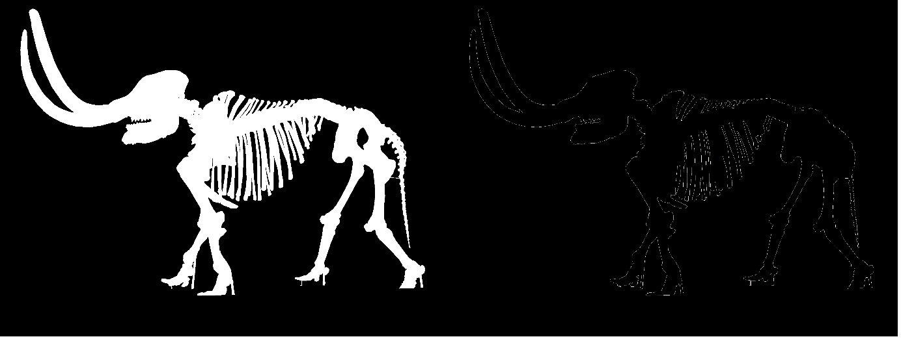
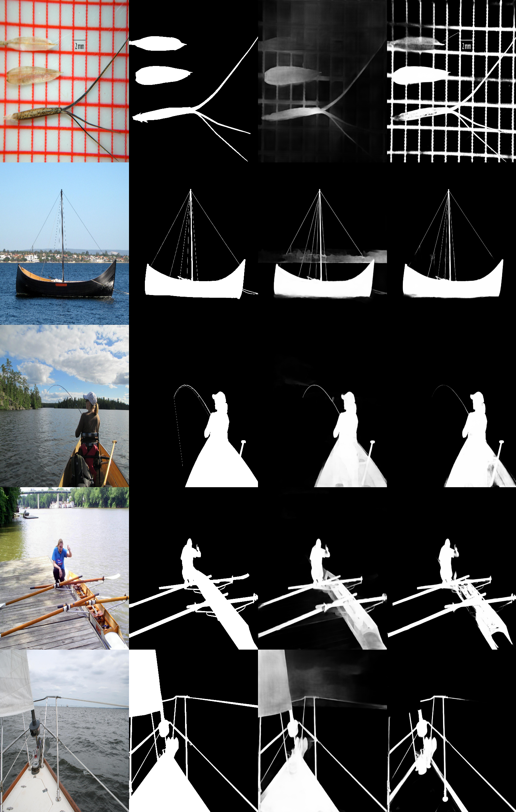

<h1 align="center" href="https://arxiv.org/pdf/2203.03041.pdf">
    Highly Accurate Dichotomous Image Segmentation （ECCV 2022）
</h1>
<p align="center">
</p>
<hr>
<h2 align="center">
    IS-Net/GT-Encoder Tuning and Data Augmentation
</h2>

<div align="center">
    If you haven't read or looked into the paper or github
    please do so before go deeper..
    <br><br>
    
    &nbsp; 
    
</div>
 
<hr>

# Data Augmentation
## Edged GT


- I've added BCE_Loss calculation between the output and Edged after filled GT loss calculation to aid the seperation between foreground and background.
- 

## Random Blur


- I've made all the dataset atleast 5 blurred patches on original images to increase complexity.
- 

## [Albumentation](https://albumentations.ai/) 
- 50% Random Horizontal Flip
- 80% Random Vertical Flip
- 80% 90 degree Rotation


- DISNET의 decoder부분에서 작아진 이미지들을 영상처리가 아닌 딥러닝으로 이미지를 키워 데이터 손실을 줄이고 GT에 가까운 side outputs들을 추출하여 loss 계산할때 큰 도움을 받는것으로 보였다.
- 보다 나은 독해를 위해 용어 정리 해 두었다.
- convolution_transpose_2d를 단순히 deconvolutional_upsample, 또는 deconv_upsample로 표현하겠다.


- GTNet 또한 DISNet과 동일한 조건을 맞춰주기 위해 stage2 낮은 stage들을 stage2 크기로 deconv_upsample로 키워서 over-fitting을 시켰다.
- GTNet은 batch_size 14에 epoch 487번을 돌아 validation_loss를 0.20을 달성해 학습을 종료 시켰다.
- visualization을 통해 섬세한 side_outputs들이 나왔다 (추후 이미지를 공개할 예정이다).

# DISNET Deconvolutional Stage Test
- deconv_upsampled는 batch_size 14에 epoch 339번을 돌았다.

|ORIGINAL_IMAGE&nbsp;&nbsp;&nbsp;&nbsp;&nbsp;GT&nbsp;&nbsp;&nbsp;&nbsp;&nbsp;DECONV_TO_D2&nbsp;&nbsp;&nbsp;&nbsp;&nbsp;ORIGINAL_ISNET|
|------------|
|

# PREREQUISITE
### 아나콘다 환경설정
- 아나콘다 환경 라이브러리 설치
```sh
conda env create --file pytorch_env.yml 
```
- 아나콘다 환경설정에 대한 자세한 설명은 [가상환경 그대로 옮기기](https://velog.io/@sheoyonj/Conda-%EA%B0%80%EC%83%81%ED%99%98%EA%B2%BD-%EA%B7%B8%EB%8C%80%EB%A1%9C-%EC%98%AE%EA%B8%B0%EA%B8%B0) 참조

# RUN
```sh
python 
```


# References
- DISNET: [xuebinqin/DIS](https://github.com/xuebinqin/DIS)
- U2NET: [xuebinqin/U-2-NET](https://github.com/xuebinqin/U-2-Net)
- EGNET: [JXingZhao/EGNet](https://github.com/JXingZhao/EGNet)
